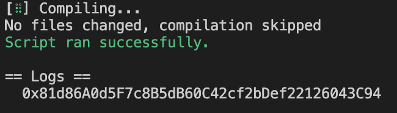
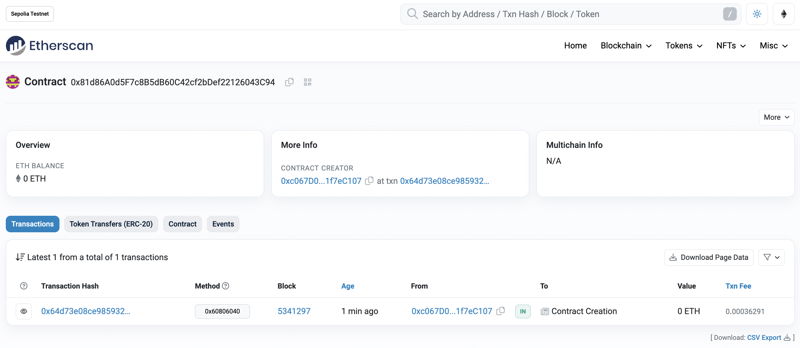

# 2024-Spring-HW0

All the detailed specified in Homework 0 documentation.

## Wallet Address
Please provide your MetaMask wallet address:  
Wallet address: `0xc067D0E40A1B4e41a2F7389590C26f771f7eC107`

## Local Testing
Please provide a screenshot of the `forge test -vvv` command running in your local environment.

## Contract Address
Please provide the contract address that you deployed on the Sepolia network.  
Contract address: `0x81d86A0d5F7c8B5dB60C42cf2bDef22126043C94`

## Sepolia Etherscan
Paste the contract address into the Sepolia Etherscan and share the screenshot.
